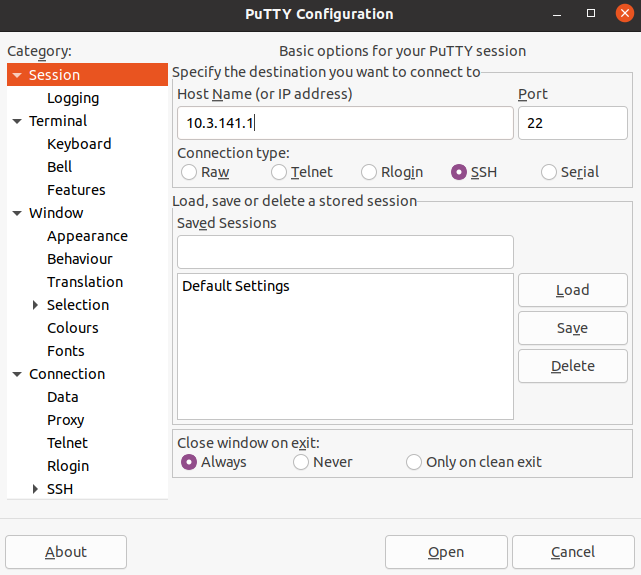

# Guide Utilisateur

## Réaliser par :
Florent VILLENEUVE - Julien TERRIER - Adrien KAISER - Olivier MAHE

# Introduction

Bienvenue dans notre projet informatique basé sur le principe d’un serveur question/réponse, nous avons conçu un jeu reprenant les règles du très célèbre « QUI-EST-CE ? ». 
Ce document est à lire par tous les joueurs pour connaître les étapes à réaliser pour pouvoir lancer une partie.

# Règles du jeu

Déroulement de la partie, une fois connecté, 
vous devrez réussir à travers un enchainement de question à trouver le nom de l'élève mystère en fonction de ses caractéristiques. 
Si vous trouvez l'élève mystère dans le temps imparti et avant les autres joueurs alors vous gagnez la partie.

# Installation logiciel

Pour commencer :

- Installer/posséder le logiciel « Putty »

- Sur Windows [putty](https://www.putty.org/)

- Sur linux

	- Ouvrez votre terminal.

	- Taper la commande : « sudo apt install putty »

---

# Connection serveur

Après avoir installer Putty:

- Connectez-vous au réseau wifi "SysQuiEstCe"

- mot de passe "sysex2021!"

- Une fois connecté:

	- Ouvrez putty

	- Connectez-vous en SSH

	- Adresse IP:  10.3.141.1

***

	

---


- Un terminal s'ouvre:

	- Connectez-vous avec l'identifiant: isen 

***


---

- Mot de passe: sysex2021!  

***


---

Félicitation, vous êtes connecté au serveur.

###Lancement de la partie

Pour lancer une partie:
- Dirigez-vous dans le bon repertoire en utilisant la commande 

```bash linenums="1"
cd Sys_QuiEstCe-/client/.
```

---


- Attendez que tous les joueurs arrivent à votre niveau.
- Lancez le programme en tapant 

```bash linenums="1"
./client
```

---

