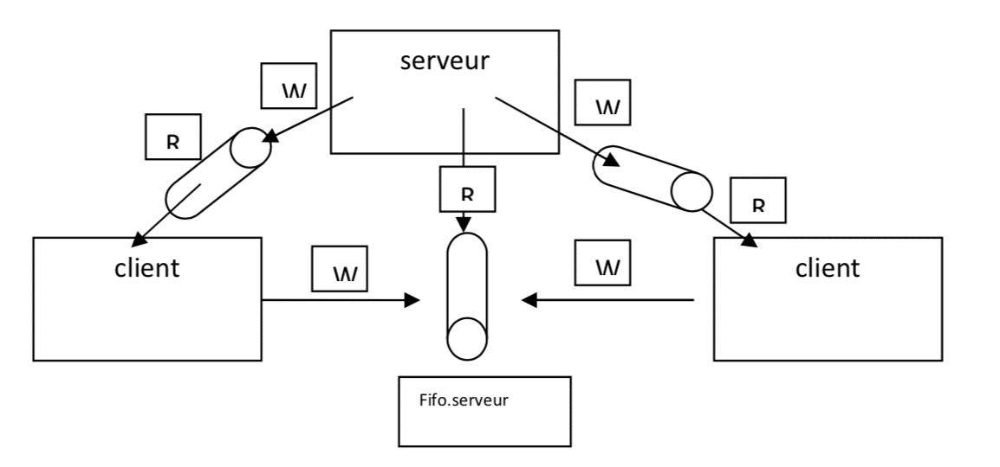
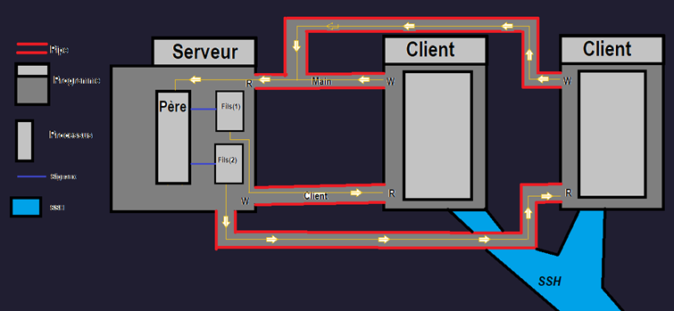
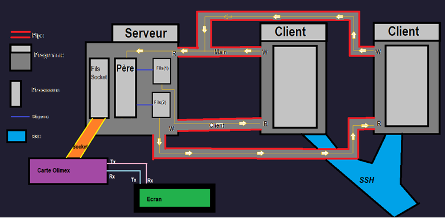

# Notice Technique

## Réaliser par :
Florent VILLENEUVE - Julien TERRIER - Adrien KAISER - Olivier MAHE

## Introduction :

Le but du projet est d'implémenter un "Qui est-ce ?" compétitif en ligne de commande qui permettra à la classe de fraterniser joyeusement durant les pauses.
Notre implémentation du jeu consistera à ce que chaque élève affronte l'ordinateur et devine le plus vite possible le personnage de celui-ci. Un classement sera effectué selon le temps mis par la classe et un gagnant pourra être désigné ainsi. L'interface étant purement textuel il faudra que les personnages utilisés soient connus de tous, nous prendront donc les élèves de la classe.

---


## Cahier des charges :

Pour le mode de jeu de base décrit plus haut :
- Un élève sera choisi aléatoirement parmi la base de données
- La liste des personnages sera affiché à l'écran de l'utilisateur comme un vrai joueur devant son plateau de jeu
- Les élèves pourront poser des questions à l'ordinateur/au serveur. 
    *Exemple : "Le personnage a-t-il les yeux bleus ?"* Ces choix ne seront pas tapés à la main mais choisie à l'aide d'un menu
- Ce cycle de question réponse se poursuit jusqu'à ce que le joueur trouve le personnage
- Le premier joueur qui gagne déclenche l'arret de la partie

---

## Organigramme de l’équipe projet :

Chef de projet | Commercial | Système Administeur | Architecte Programme
 :---: | :---: | :---:  | :---: 
|  |  |  
Olivier MAHE | Adrien KAISER | Julien TERRIER | Florent VILLENEUVE
         
---

## Mise en place du projet :

### Prémice du projet
Nous avons dans un premier temps défini, les grandes lignes du projet en se réunissant autour d'un diagramme explicatif de nos idées.
Une fois nos idées mises en accords, nous avons commencé les tests avec la réalisation de pipe nommés,  la base de données...

---



---

Dès que notre base fut établie, nous nous sommes lancé dans l'élaboration d'une architecture viable. C'est-à-dire d'avoir une base qui fait tourner le programme sur une RPI avec une connection des clients en ssh,
Pour plus de détails, nous avons réaliser deux programmes fonctionnant sur la même machine qui communique via des pipes.

### Première base

Après avoir conçu notre première architecture nous avons pu affiner notre vision du projet et nous recentrer sur une même vision des choses,
en modifiant le fonctionnement du programme serveur pour qu'il crée un processus fils à chaque connexion d'un client qui renvoie une réponse au client pour savoir si tout c'est bien créer.

---



---

Une fois la communication fonctionnelle nous avons commencé l'élaboration du menu permettant de jouer dans le programme client pour réduire le nombre d'échanges serveur/client.

### Architecture finale

Enfin, après avoir réussi à implémenter toutes nos attentes, nous avons choisi d'ajouter une carte olimex avec un écran à notre système pour afficher le nom du gagnant, et également parfaire l'ensemble du projet 

---



---

### Concept programmation de système linux

Le but de ce projet fut avant tout de nous familiariser avec les concepts vus en cours.

#### Les tubes

Nous avons utilisé un tube nommé principal pour assurer la communication entre tous les clients et le serveur, ainsi que plusieurs tubes nommés individuels permettant au serveur de communiquer avec chaque client.
---

#### Les appels systèmes

Les fork() sont utilisés pour instancier des processus fils lors de la connexion des clients,
et également pour le sous-programme socket.c
---

#### Les primitives de recouvrements

Nous utilisons un execv() qui nous permet de modifier un processus fils du serveur et ainsi lancer le sous-programme socket.c

#### Les signaux

Des signaux sont utilisés pour interrompre des processus comme:
* le signal SIGALRM pour arrêter le programme une fois que le nombre de secondes placées en paramètres est écoulé.
* les signaux SIGUSR pour notifier les clients lors de la victoire d'un joueur et aussi pour informer que le nombre maximal de joueurs sont atteints.
* le signal SIGKILL permet d'empecher un client non autorisé à rejoindre la partie.

---

### Test Unitaire

En programmation informatique, le test unitaire est une procédure permettant de vérifier le bon fonctionnement d'une partie précise d'un logiciel ou d'une portion d'un programme (appelée « unité » ou « module »).

Check est un framework de tests unitaires pour C: 
Il dispose d'une interface simple pour définir des tests unitaires, mettant peu d'obstacles pour le développeur. Les tests sont exécutés dans un espace d'adressage séparé, de sorte que les échecs d'assertion et les erreurs de code qui provoquent des défauts de segmentation ou d'autres signaux peuvent être détectés.

```bash linenums="1"
START_TEST(test_nofork_sideeffects)

{

	ck_assert_msg(counter == 1,

		"Side effects not seen across tests");

}

END_TEST
```
